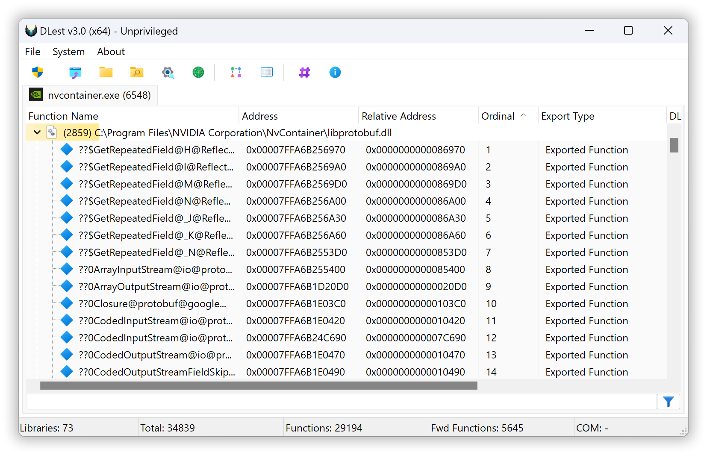
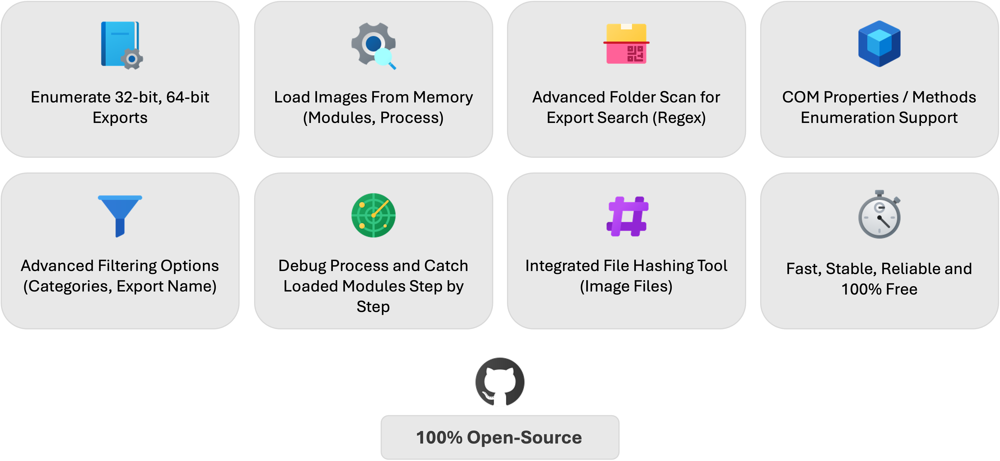
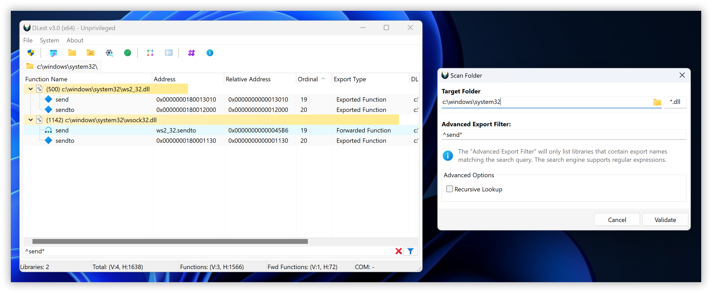
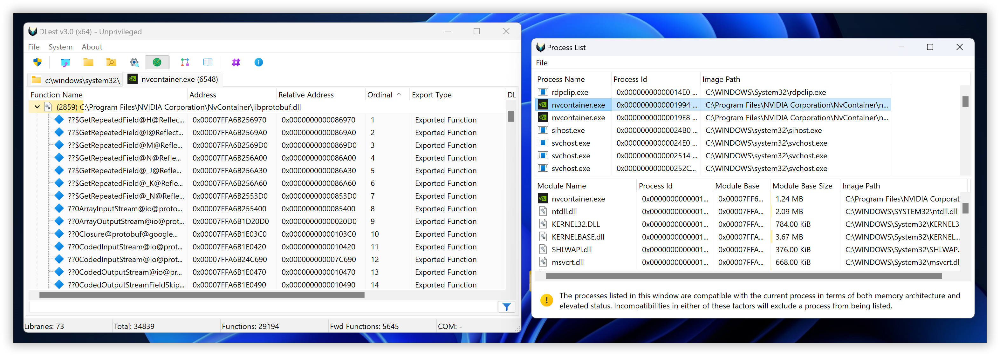
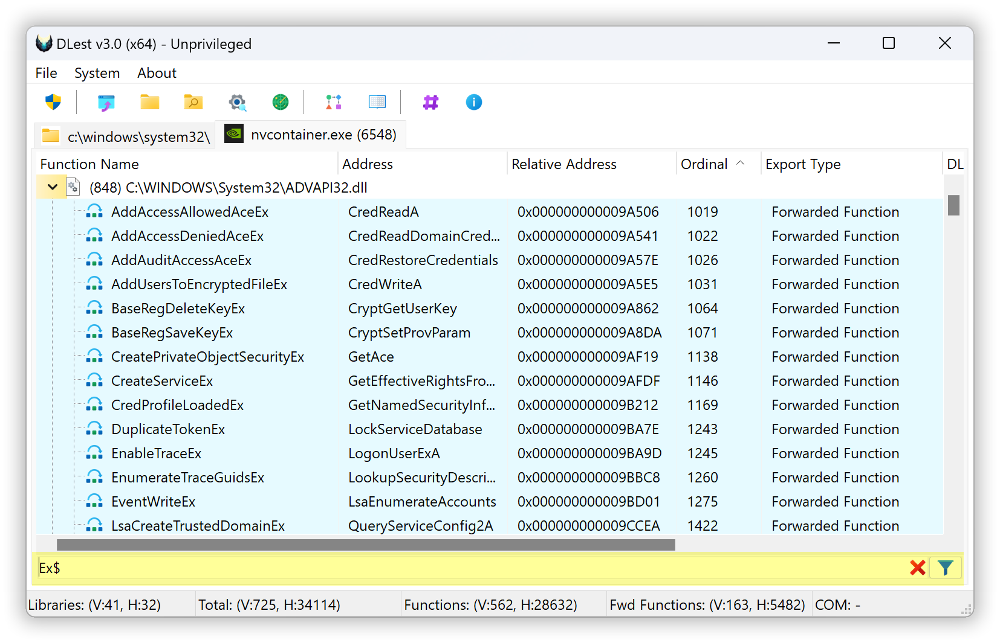
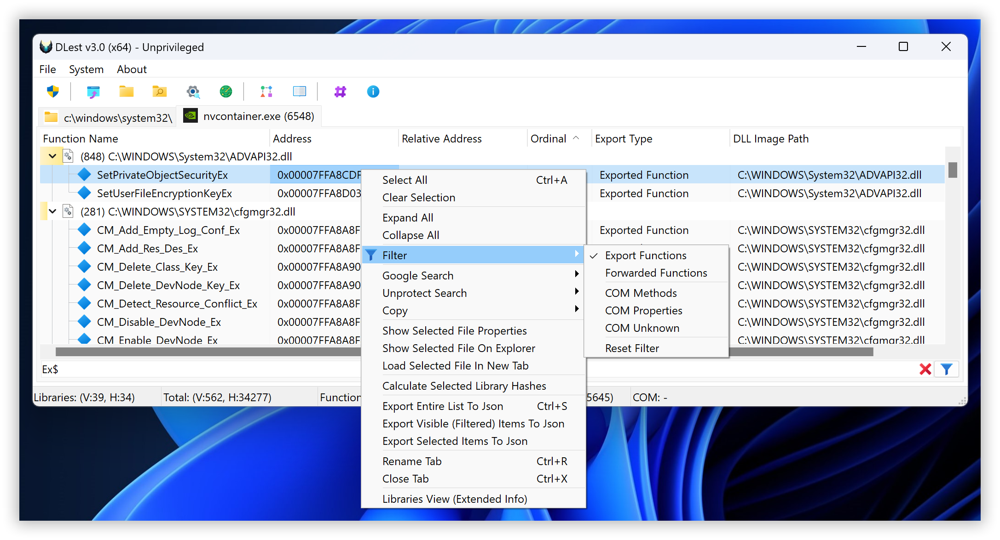
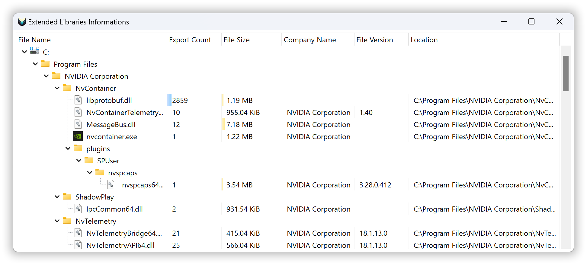
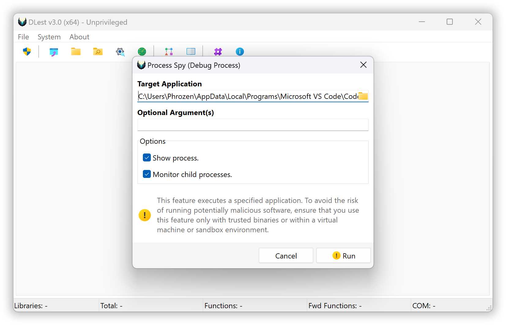
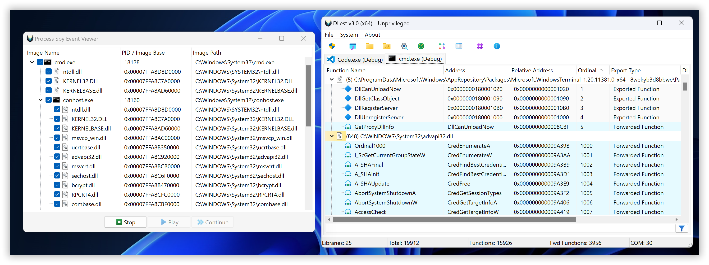
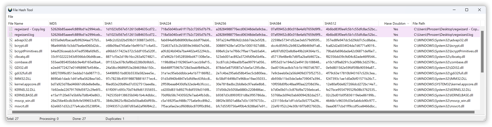

# DLest

DLest is specifically designed to assist developers and malware analysts with the analysis and manipulation of exported functions in Portable Executable (PE) files, particularly DLLs. With DLest, you can easily enumerate exported functions using a variety of methods, including drag and drop, opening a folder, or recursively scanning a folder with regular expression filtering to only include PE files with specific export function names.

In addition to parsing PE files stored on disk, DLest also supports the analysis of memory-loaded modules, allowing you to analyze and manipulate exported functions in real time. This makes DLest an invaluable tool for malware analysts during reverse engineering or incident response. You can even dump a reconstructed version of any module for further analysis or reuse.

This application is fully multithreaded, ensuring efficient and fast processing of even large numbers of PE files. Whether you're a developer looking to analyze and manipulate exported functions or a malware analyst in need of a reliable tool to assist with your work, DLest is sure to be a valuable addition to your toolkit. Its name, DLest, reflects its ability to "deleste" you from fastidious work, streamlining and simplifying your tasks.

---

# Highlighted Features

- Supports both x86-32 (PE) and x86-64 (PE+) bit Portable Executable Files.
- Support Named / Unnamed Exports.
- Support COM Properties and Methods Enumeration.
- Advanced Filtering (By export name, export kind).
- Load PE File(s) from Drag n Drop (Support UAC).
- Load PE File(s) from open dialog.
- Load PE File(s) from entire folder.
- Scan for PE File(s) with advanced controls (recursivity and export function filtering via text/regex).
- Scan and parse memory mapped modules from running process.
- Debug process and catch DLL Load events (Optionally step by step user-control)
- Integrated File Hash Tool (MD5, SHA1, SHA2 Families)
- Google Search.
- Unprotect Search.
- Multi Tabs.

And more!

---

# Key Features

## Scan Folder

The scan folder mode in DLest allows you to perform a more advanced and comprehensive scan of a folder or directory structure, locating any valid DLL files that offer exported functions. This mode allows you to recursively scan a folder and its subfolders, looking for compatible and valid PE files that offer exported functions.

One of the key features of the scan folder mode is its ability to use advanced regular expression (regex) queries to filter certain files based on the names of their exported functions. This can be especially useful if you are looking for specific functions or need to exclude certain files from the scan.

In addition to DLL files, the scan folder mode also includes the option to scan for any compatible and valid PE files, rather than just limiting the search to DLLs. This makes it a versatile and powerful tool for locating and analyzing exported functions in a variety of different types of PE files.

Whether you need to quickly locate exported functions in a single folder or perform a more comprehensive and advanced scan of a larger directory structure, the scan folder mode in DLest has you covered.

## In-Memory Modules

The load from running process mode in DLest allows you to parse the Portable Executable (PE) header for exported functions directly from in-memory modules, rather than from files stored on disk. This can be a useful feature for developers and malware analysts who need to analyze exported functions in real time or who are working with memory-loaded modules that are not stored on disk.

To use the load from running process mode, you will need to select the desired process from a list of currently running processes on your system. DLest will then parse the PE header for the selected process and identify any exported functions within it.

This mode is particularly useful for analyzing and manipulating exported functions in real time, as it allows you to directly access the in-memory modules of a running process. Whether you are a developer looking to optimize the performance of your code or a malware analyst trying to understand the behavior of a malicious program, the load from running process mode in DLest is a valuable tool to have at your disposal.

### What is the "Dump Reconstructed PE Image" feature ?

The "dump reconstructed PE image" feature in DLest allows you to save a copy of any memory-mapped modules from a target process to a file for further analysis or usage. This can be a useful feature for developers and malware analysts who want to examine the inner workings of a module in more detail or who need to reuse a specific version of a module for testing or other purposes.

To use this feature, you will need to select the desired process and module from a list of currently running processes and their memory-mapped modules. DLest will then create a copy of the selected module and reconstruct it in a format that can be read by PE analyzers or other tools.

The reconstructed PE image can be saved to a file on your system for later use. This allows you to examine the module in more detail, understand its behavior, or reuse it for testing or other purposes. Whether you are a developer looking to optimize the performance of your code or a malware analyst trying to understand the behavior of a malicious program, the "dump reconstructed PE image" feature in DLest is a valuable tool to have at your disposal.

# Exported Function Filtering

The live exports filtering feature in DLest allows you to use regular expressions to filter the exported functions displayed in the tool in real time. This can be a useful feature for developers and malware analysts who need to quickly locate specific exported functions or who want to exclude certain functions from the list.

To use this feature, simply enter a regular expression into the designated field and click the "apply" button. DLest will then use the regular expression to filter the list of exported functions, displaying only those that match the pattern.

While this feature can be very useful, it is worth noting that it may be slower when applied to a very large number of exported functions. In such cases, it may take longer for DLest to apply the filter and update the display. However, in most cases, the live exports filtering feature is fast and efficient, making it a valuable tool for quickly locating specific exported functions or excluding unwanted ones.

Starting with version 3 of DLest, you can now filter enumerated exports by their type: Export Function, Forwarded Function, COM Method, COM Property, and more.

# Extended Libraries Informations

The extended libraries information window in DLest is a feature that displays a list of parsed Portable Executable (PE) files from the current tab context, along with a variety of details about each file. This can be a useful feature for developers and malware analysts who need to quickly access information about the libraries they are working with.

The extended libraries information window displays a list of parsed PE files, along with the following information for each file:

Library name: The name of the library, as it appears in the file's header.

Exports count: The total number of exported functions in the library.

File size: The size of the file, in bytes.

File attributes: A list of attributes associated with the file, such as whether it is read-only or hidden.

By using the extended libraries information window, you can quickly access a wealth of information about the libraries you are working with, making it easier to understand their contents and behavior. Whether you are a developer looking to optimize the performance of your code or a malware analyst trying to understand the behavior of a malicious program, the extended libraries information window is a valuable resource to have at your disposal.

# Process Spy (Debug)

Process Spy is a dynamic analysis feature that allows you to create a new process in debug mode from a targeted application and listen for DLL Load debug events to capture loaded modules step by step, controlled by the user. If you prefer not to go step by step, you can click the play button to let all events proceed automatically. You decide when to stop the debugging to enumerate exported functions from the captured library image files.

Using the step-by-step method (via the continue button) is recommended for processes that might exit after completing their tasks.

This feature is a valuable alternative to Process Modules Enumeration because some modules might appear temporarily and then disappear. Using this feature, you can trace which DLLs are loaded in real-time.

# File Hash Tool

Starting with version 3.0 of DLest, file hashes are now calculated on demand by the user using the File Hash Tool. This tool allows you to send any libraries (from the export list, process list, modules list, Process Spy capture event list, etc.) to the hash list and calculate file hashes for MD5, SHA-1, and the SHA-2 family. It also highlights potential duplicate files by hash comparison. Note that you can also use this tool as a standalone feature; it supports opening any file or dragging and dropping files from your desktop.

# Changelog

## Dec 2022

- First Release

## Jun 2023

- Enumerate COM Object (Method & Properties) - File only (not in-memory yet)
- Possibility to select which items user want to enumerate (exported function, com properties or methods)
- Few application icons updated for more confort.
- Virtual TreeView component updated to version 7.6.4.
- Compiled with Delphi 11.3.

## Jun 2024

- Compiled with Delphi 12 Version 29.0.51961.7529
- Virtual TreeView Component updated to Version 8.0.3
- Improved design, icons, and structure
- Unprotect Search integrated (Module / API Name)
- Cancel folder scan now works as expected
- It is now possible to cancel the export list enumeration task
- To considerably improve speed, library hashing (MD5, SHA1, SHA2) has been removed from the export enumeration task
- Better thread synchronization/queue practices implemented to limit overhead and increase speed
- A new live filter mechanism has been added to enable filtering of exports by their type. This filter works in conjunction with the export search input, allowing for seamless filtering without requiring a refresh.
- Export statistics displayed to new status bar
- Folder Search "Deep Scan" was replaced by user-defined wildcard file filter.
- Extended Library Information feature now offer by default to display libraries as a tree
- Anonymous exported function / forwarded function are now enumerated (Lone ordinals)
- Process Spy Feature : Debug a process and monitor for DLL Load signals for export enumeration.
- File Hash Calculation Tool Feature added.
- Other code quality improvements

# Special Thanks

- Thomas Roccia ([@fr0gger_](https://twitter.com/fr0gger_))
- mudpak ([Mudsor MASOOD](https://www.linkedin.com/in/mudsormasood)) for his valuable support and testing.
- [Jam Software](https://www.jam-software.com/virtual-treeview) : TVirtualStringTree Component
- [onryldz](https://github.com/onryldz/x-superobject) : XSuperObject Lib
